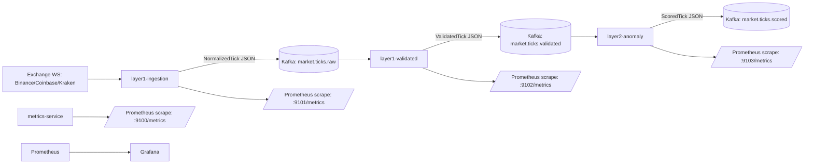

# Secure Algorithmic Trading Platform — Implementation So Far (Phases 1–4)

_Date: 2026-04-11_

This document is an article-style explanation of what has been implemented in this repository so far, following the phase order described in `trading_blueprint_final.docx.md`.

The platform’s core idea is **trust-first market data**: before any strategy logic runs, ticks are collected from multiple exchanges, aligned in time, checked for divergence, scored for integrity/latency, and chained into an immutable hash log. Only then do we attach an anomaly score and a global “system state” label that downstream trading components can treat as a safety contract.

---

## Executive Summary

What we have today is a running, observable end-to-end pipeline:

1. **Layer 1 ingestion** connects to live exchange WebSockets (Binance/Coinbase/Kraken), normalizes market ticks, and (optionally) publishes them to Kafka.
2. **Layer 1 validation** consumes raw ticks, aligns them into a 50ms window per symbol, performs consensus + divergence quarantine, computes a blueprint-style trust score (T1–T5), appends a cryptographic hash-chain entry, and publishes a `ValidatedTick`.
3. **Offline HMM training** downloads Binance Vision historical klines, derives 30-minute realized volatility, trains a 3-state `GaussianHMM`, and writes the trained model + metadata artifacts.
4. **Layer 2 anomaly detection** consumes `ValidatedTick`, builds a rolling feature window, infers regime via the HMM, scores anomalies via Isolation Forest + Half-Space Trees, applies the MAD guard, runs the decision-gate hysteresis, and publishes `ScoredTick` to Kafka.
5. **Observability** is first-class: Prometheus scrapes every service’s `/metrics`, and Grafana is pre-provisioned with a Prometheus datasource.

The next major milestone (not yet implemented) is **Phase 5 / Layer 3**, where we convert the scored tick stream into candles and compute indicators/signals.

---

## High-level Architecture

### Runtime topology (Docker Compose)

The Compose stack is defined in `docker-compose.yml` and includes:

- ZooKeeper + Kafka (dual listeners: one for containers, one for the host)
- `metrics-service` (FastAPI example service exporting `/metrics`)
- `layer1-ingestion` (live adapters → normalized ticks → Kafka raw topic)
- `layer1-validated` (raw topic → validation/trust/hash-chain → validated topic)
- `layer2-anomaly` (validated topic → anomaly/regime/state → scored topic)
- Prometheus + Grafana

Kafka listeners are configured so:

- Containers use `kafka:9092`
- Host tools use `localhost:29092`

### Dataflow and Kafka topics



### Canonical message contracts (Pydantic)

All key message contracts live in `shared/schemas.py`:

- `NormalizedTick` — produced by Layer 1 ingestion (per-exchange WS adapters)
- `ValidatedTick` — produced by Layer 1 validation (consensus + trust + hash-chain)
- `ScoredTick` — produced by Layer 2 (anomaly score + regime + system state)

These models are configured with `extra="forbid"` to prevent silent schema drift.

---

## Phase 1 — Foundation Stack (Docker + Kafka + Monitoring)

### What we implemented

- **Kafka + ZooKeeper** with a reliable local developer experience.
- **Prometheus** configured to scrape service metrics.
- **Grafana** provisioned with a Prometheus datasource (`ops/grafana/provisioning/datasources/datasource.yml`).
- **A reference metrics service** (`services/metrics`) implemented with FastAPI.
- A host-side **Kafka smoke test** script that validates produce/consume and consumer-group semantics.

### Why this matters

Before building trading logic, we need:

- A durable event bus (Kafka) to make each layer independently testable.
- Observability from day one, so later security and anomaly properties can be verified with data.

### Where to look

- Compose stack: `docker-compose.yml`
- Prometheus scrape config: `ops/prometheus/prometheus.yml`
- Grafana datasource provisioning: `ops/grafana/provisioning/datasources/datasource.yml`
- FastAPI metrics service: `services/metrics/app/main.py`
- Kafka smoke test: `scripts/kafka_smoke_test.py`

---

## Phase 2 — Layer 1 Data Pipeline (Ingestion → Trust → Validation)

Layer 1 is the “data integrity engine”. It is responsible for answering:

- Are we seeing consistent prices across exchanges?
- How fresh is the data?
- Can we prove continuity and tamper-evidence over time?

### 2.1 Exchange adapters (console-first, then Kafka)

**Implementation:** `services/layer1_ingestion/adapters/`

Each exchange adapter is a WebSocket client that streams live updates and emits a normalized `NormalizedTick`.

Common adapter behavior is in `services/layer1_ingestion/adapters/base.py`:

- **TLS certificate pinning** is checked before connecting.
- **Heartbeat liveness**: if no message arrives within a timeout window, we perform a ping/pong check; failure triggers reconnect.
- **Reconnect strategy**: exponential backoff with jitter.
- **REST snapshot on reconnect**: best-effort informational fetch (Phase 2.1).

Normalized ticks contain:

- `bid`, `ask`, `last_price`
- `volume_24h`
- `exchange_timestamp_ms` and `received_timestamp_ms` (critical for latency scoring)

Unit tests validate parsing logic:

- `tests/test_layer1_adapters.py`

Audit events throughout Layer 1 are emitted via `shared/audit.py` as structured JSON lines to stdout (and optionally to a file via `AUDIT_LOG_PATH`). This is a Phase 2 stub; later blueprint phases will route audit events into Kafka and persist them in a dedicated audit layer.

### 2.2 TLS certificate pinning

**Pins live in:** `config/tls_pins.json`

**Implementation:** `shared/tls_pinning.py`

At runtime, adapters verify that the leaf certificate fingerprint matches the expected value. There is also a non-fatal **expiry warning** audit event emitted when a certificate is within 30 days of expiry.

A helper script exists to print fingerprints:

- `scripts/print_tls_fingerprint.py`

Unit test:

- `tests/test_tls_pinning.py`

Operational note: certificate rotation will intentionally break connectivity until pins are updated.

### 2.3 Kafka integration for raw ticks (`market.ticks.raw`)

Layer 1 ingestion can run in “print-only” mode or publish to Kafka.

- Entry point: `services/layer1_ingestion/run_console.py`
- Kafka publisher: `services/layer1_ingestion/kafka_publisher.py`

A long-running stability runner exists for live feed soak testing:

- `services/layer1_ingestion/soak_runner.py`

The publisher implements a blueprint-style **bounded outage buffer**:

- Messages are queued in memory.
- If Kafka is unavailable and the queue is full, the system **drops the oldest** (or, if it still can’t enqueue, drops the new one) and emits an audit event.
- Topic creation can be ensured via `KAFKA_ENSURE_TOPICS`.

### 2.4 Consensus engine (divergence quarantine)

**Implementation:** `services/layer1_consensus/engine.py`

Core behavior:

- Align ticks by symbol into a **50ms aggregation window** (`TickAligner`).
- For each aligned window, compute an unweighted median to detect divergence.
- Any source outside a **0.3% tolerance** is flagged divergent and placed into **quarantine**.
- Quarantined sources are re-evaluated on subsequent windows; if they return within tolerance they are released.
- A **3-strike escalation** emits an audit event (`consensus.divergence.escalated`).
- Consensus price uses a **volume-weighted median** of usable sources.

Unit tests:

- `tests/test_layer1_consensus.py`

### 2.5 Trust score (T1–T5)

**Implementation:** `services/layer1_trust/scoring.py`

The trust score is a weighted sum of five sub-scores:

- **T1** TLS validity (binary)
- **T2** consensus agreement (agreeing/total)
- **T3** freshness = exp(-λ·latency_ms), with 25ms half-life
- **T4** sequence integrity penalty (currently no penalty when sequence IDs are not available)
- **T5** hash-chain continuity (binary)

Weights are loaded from `config/trust_weights.json` via `load_trust_weights()`.

Unit tests:

- `tests/test_layer1_trust_scoring.py`

### 2.6 Internal hash log (hash chain)

**Implementation:** `services/layer1_hashlog/hash_chain.py`

Each validated window is appended to an **append-only JSONL hash chain**, where:

- `tick_hash = SHA256(canonical_json({symbol, consensus_mid, trust_score, received_timestamp_ms, previous_hash}))`
- The log is written asynchronously.
- `verify_hash_chain()` recomputes hashes and validates continuity.

Unit test:

- `tests/test_layer1_hash_chain.py`

### 2.7 Wiring: validated topic (`market.ticks.validated`)

**Implementation:** `services/layer1_validated/service.py`

This service consumes raw ticks, builds aligned windows, runs consensus + trust scoring + hash-chain append, then publishes `ValidatedTick` using a buffered publisher (`services/layer1_validated/kafka_json_publisher.py`).

`ValidatedTick` now includes two optional fields (added for Layer 2 feature construction):

- `volume_24h` (aggregated median across used sources)
- `spread` (aggregated relative spread `(ask-bid)/mid`)

These are optional for backward compatibility with previously emitted messages.

---

## Phase 3 — Offline HMM Training (Regime Classifier)

Layer 2’s regime classifier is trained offline and loaded at runtime.

### What it does

- Downloads 90 days of Binance Vision daily zip files (1m klines by default).
- Computes 30-minute realized volatility.
- Trains a **3-state Gaussian HMM** (`hmmlearn.hmm.GaussianHMM`).
- Serializes the model using **joblib** and writes metadata.

### Key implementation details

**Downloader/parser:** `services/hmm_training/binance_vision.py`

- Handles Binance Vision “missing day” behavior by treating HTTP 404 as `FileNotFoundError`.
- Normalizes timestamps to milliseconds (some datasets appear to use microseconds/nanoseconds).

**Trainer:** `services/hmm_training/train.py`

- Defaults `--end-date` to **yesterday** to avoid “today’s file not posted yet” failures.
- Writes artifacts to `artifacts/hmm/`:
  - `model.pkl`
  - `metadata.json`

### How to run

Install ML deps:

```powershell
.\.venv\Scripts\python -m pip install -r requirements-ml.txt
```

Train:

```powershell
.\.venv\Scripts\python -m services.hmm_training.train --days 90 --symbols BTCUSDT,ETHUSDT
```

---

## Phase 4 — Layer 2 Market Anomaly Detection (Scoring + Decision Gate)

Layer 2 attaches the “market safety envelope” to every validated tick: anomaly score, regime, and system state.

### 4.1 Rolling statistics & feature window

**Implementation:** `services/layer2_anomaly/engine.py`

Per symbol, Layer 2 maintains:

- A rolling window of 500 ticks (raw return, log-volume, spread)
- Rolling mean/std for z-scoring
- Rolling MAD (median absolute deviation) for robust return guard
- A 30-minute realized volatility accumulator feeding the HMM

### 4.2 HMM regime inference

**Implementation:** `HMMRegimeClassifier` in `services/layer2_anomaly/engine.py`

- Loads `artifacts/hmm/model.pkl` via joblib.
- Updates a rolling RV history.
- Computes:
  - `regime` via Viterbi (`predict()`)
  - `regime_posterior` via `predict_proba()`

### 4.3 Feature vector construction

Layer 2 constructs a feature vector aligned with the blueprint:

- f1: log return (z-scored)
- f2: log volume (z-scored; uses `volume_24h` when present)
- f3: spread (z-scored; uses `spread` when present)
- f4: regime (discrete)
- f5: trust score (bounded)
- f6: time-of-day sin/cos (bounded)

If `volume_24h` or `spread` are missing, Layer 2 currently falls back to 0.0 for that raw feature.

### 4.4 Parallel anomaly detectors

Two detectors run in parallel:

- **Isolation Forest** (`sklearn.ensemble.IsolationForest`): retrained periodically in a background thread, with an atomic model swap.
- **Half-Space Trees** (`river.anomaly.HalfSpaceTrees`): truly streaming, updated every tick.

A critical implementation detail from the blueprint is enforced:

- **HST scores first, then learns** (`score_one()` then `learn_one()`), to avoid artificially deflating “novelty”.

### 4.5 Fusion + MAD guard

Fusion is a weighted combination:

- `A_combined = 0.45 * IF + 0.55 * HST` (weights configurable via env)

MAD guard:

- Uses regime-dependent multipliers k={3,5,8}
- If the raw return exceeds k·MAD, we floor the final anomaly score to at least 0.65.

### 4.6 Decision gate with hysteresis

**Implementation:** `DecisionGate` in `services/layer2_anomaly/engine.py`

The system state is a function of:

- Trust threshold (default 0.60)
- Anomaly threshold (default 0.55)

Base matrix:

- High trust + low anomaly → NORMAL
- High trust + high anomaly → CONSERVATIVE
- Low trust + low anomaly → DEGRADED
- Low trust + high anomaly → HALT

Hysteresis:

- Downgrades are immediate (safety-first).
- Upgrades require **10 consecutive qualifying ticks**.
- Leaving HALT requires **10 consecutive NORMAL-qualifying ticks**.

### 4.7 Output contract (`market.ticks.scored`)

**Schema:** `shared/schemas.py` → `ScoredTick`

`ScoredTick` includes all `ValidatedTick` fields plus:

- `anomaly_score`, `if_score`, `hst_score`
- `regime`, `regime_posterior`
- `system_state`
- `mad_guard_triggered`

**Service entry point:** `services/layer2_anomaly/service.py`

---

## Observability (Prometheus metrics per service)

### Metrics endpoints

- `metrics-service`: `:9100/metrics` (FastAPI)
- `layer1-ingestion`: `:9101/metrics` (minimal HTTP server)
- `layer1-validated`: `:9102/metrics` (minimal HTTP server)
- `layer2-anomaly`: `:9103/metrics` (minimal HTTP server)

The minimal metrics server is implemented in `shared/metrics_http.py`.

### Prometheus configuration

Targets are defined in `ops/prometheus/prometheus.yml`. Scrape interval is 5 seconds.

Grafana is configured to point at Prometheus via Docker DNS (`http://prometheus:9090`).

---

## Testing & Verification

### Unit tests

The repo includes focused tests that validate the most failure-prone logic:

- Adapter message parsing: `tests/test_layer1_adapters.py`
- Divergence quarantine and escalation: `tests/test_layer1_consensus.py`
- Trust score math: `tests/test_layer1_trust_scoring.py`
- Hash chain integrity: `tests/test_layer1_hash_chain.py`
- TLS pinning refusal on mismatch: `tests/test_tls_pinning.py`

### End-to-end checks (Kafka topics)

From the host, you can consume topics using the provided scripts:

- Raw ticks: `scripts/consume_market_ticks_raw.py`
- Validated ticks: `scripts/consume_market_ticks_validated.py`
- Scored ticks: `scripts/consume_market_ticks_scored.py`

There is also a smoke test for Kafka correctness:

- `scripts/kafka_smoke_test.py`

From inside the Kafka container, you can also use `kafka-console-consumer`.

---

## How to Run the Current System

### Bring up the full stack

```powershell
docker compose up -d --build
```

Key URLs:

- Prometheus: `http://localhost:9090`
- Grafana: `http://localhost:3000` (admin/admin)
- Targets page: `http://localhost:9090/targets`

### Confirm scored ticks are flowing

```powershell
docker compose exec -T kafka kafka-console-consumer --bootstrap-server kafka:9092 --topic market.ticks.scored --consumer-property auto.offset.reset=latest --max-messages 5
```

---

## Known Gaps / Not Implemented Yet

This repo is intentionally incomplete beyond Phase 4.

Not yet implemented:

- **Phase 5 / Layer 3**: candle aggregation (5m and 1h), indicator suite, signal generation
- **Layer 4 risk engine**, **Layer 5 execution**, **Layer 6 audit persistence**
- A full API backend beyond the simple `metrics-service`
- Enforced network egress restrictions (Compose currently does not restrict outbound internet per-container)

There are also a few intentional simplifications in the current layers:

- Layer 1 sequence gap scoring is not fully wired across all exchanges (missing sequence IDs are treated as no penalty).
- Layer 2’s volume/spread features fall back to 0.0 if Layer 1 didn’t provide them (this is why we made those fields optional in `ValidatedTick`).

---

## What’s Next (Per Blueprint Order)

The next phase is **Layer 3 — Trading Strategy Engine**, which (per the blueprint) begins by consuming `market.ticks.scored` and building candle streams, then computing indicators on candles.

A key boundary decision is already in place conceptually:

- Layers 1–2 remain tick-level for integrity/anomaly detection.
- The Layer 2 → Layer 3 boundary is where we shift to **candle-based** strategy logic.
